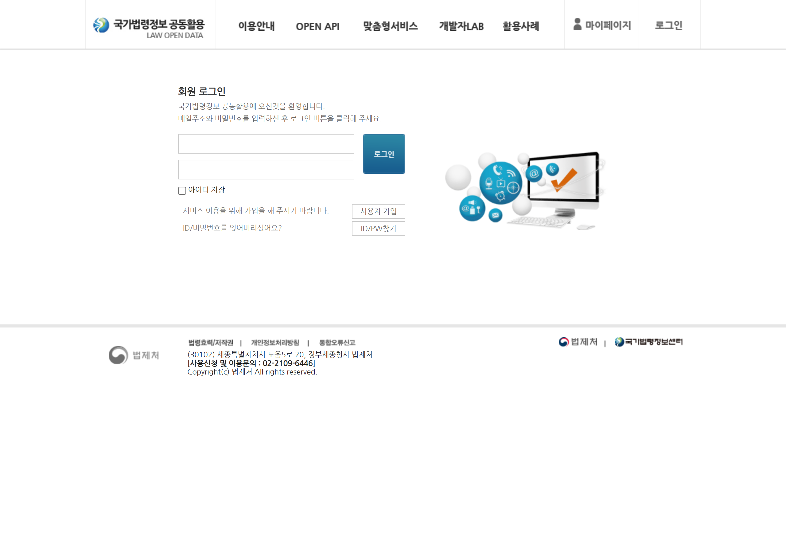
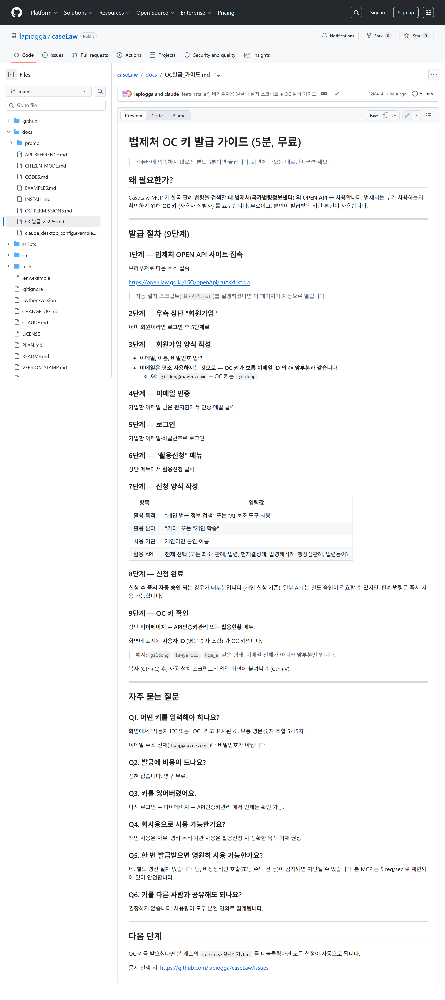
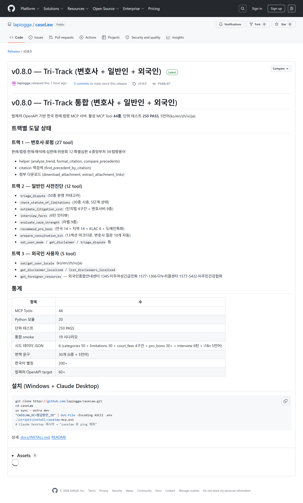
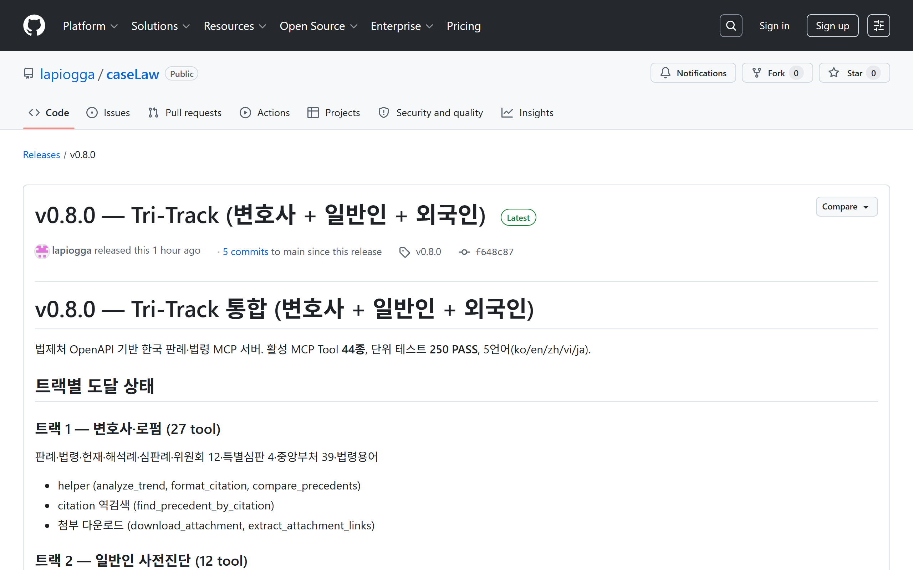
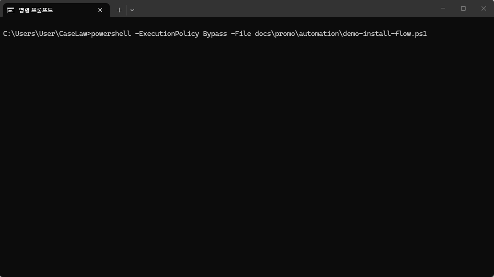
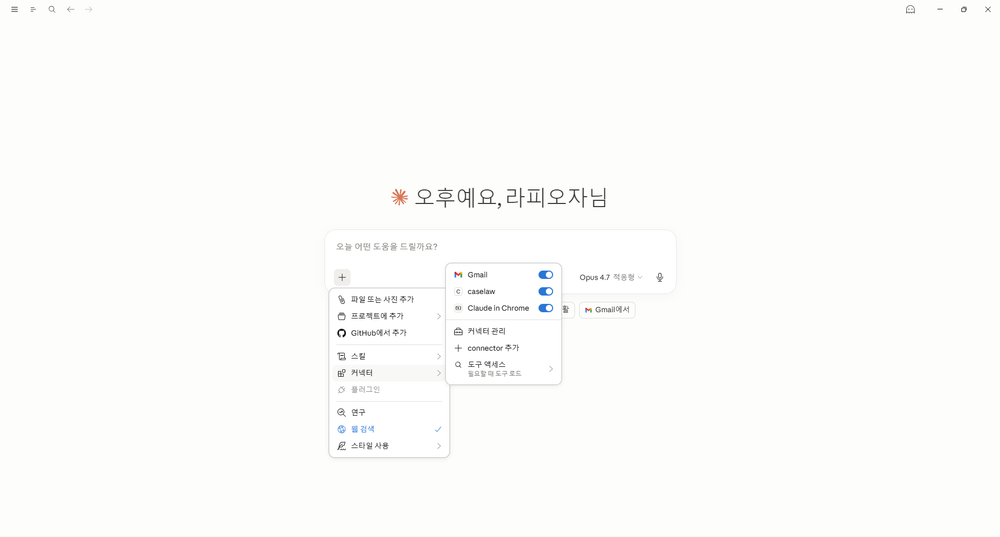
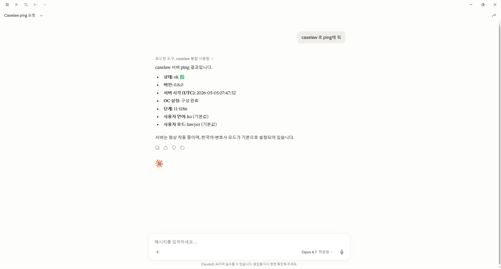
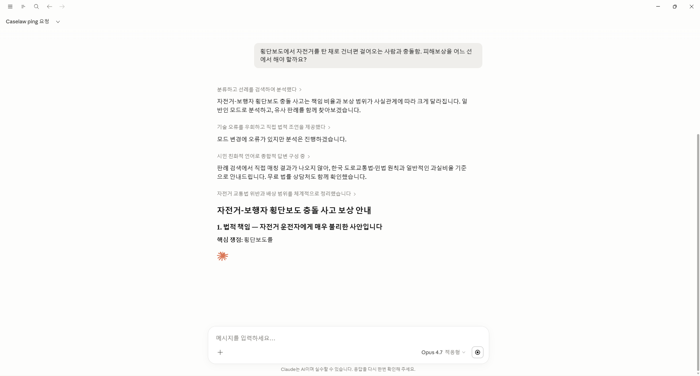
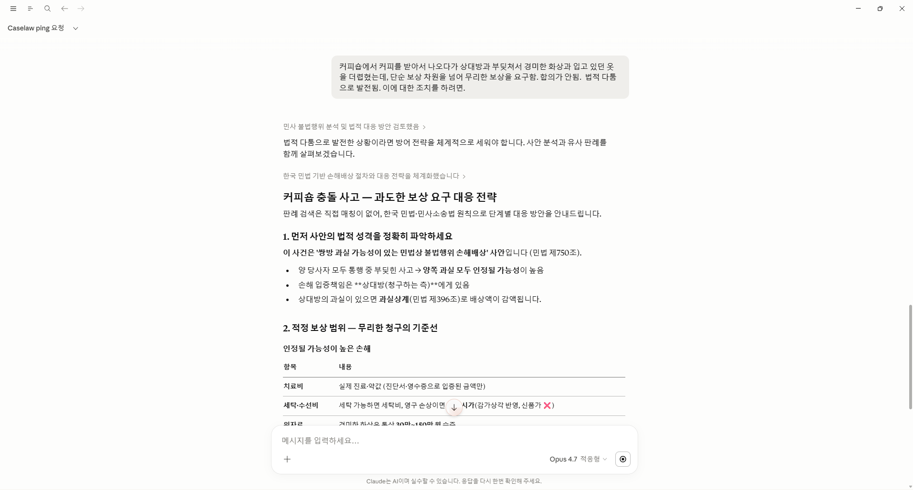

# CaseLaw MCP 설치 시각 가이드 (스크린샷 포함)

> 컴퓨터에 익숙하지 않으신 분도 차근차근 따라할 수 있도록, 모든 단계에 실제 화면 캡처를 첨부했습니다.
> 클릭만 하시면 됩니다.

**소요 시간**: 10-15분 (OC 키 발급 5분 + 자동 설치 3-7분 + 첫 사용 확인 2분)
**비용**: 전부 무료

---

## 목차

1. [1단계 — 법제처 OC 키 발급](#1단계--법제처-oc-키-발급-5분-무료)
2. [2단계 — 설치 패키지 다운로드](#2단계--설치-패키지-다운로드-1분)
3. [3단계 — 자동 설치 실행](#3단계--자동-설치-실행-3-7분)
4. [4단계 — Claude Desktop 첫 확인](#4단계--claude-desktop-첫-확인-1분)
5. [5단계 — 실제 사용 예시](#5단계--실제-사용-예시)
6. [자주 묻는 질문](#자주-묻는-질문)

---

## 1단계 — 법제처 OC 키 발급 (5분, 무료)

### 1-1. 사이트 접속

브라우저 주소창에 다음을 입력하거나 [여기](https://open.law.go.kr/LSO/openApi/cuAskList.do)를 누르세요.

```
https://open.law.go.kr/LSO/openApi/cuAskList.do
```



### 1-2. 회원가입 → 활용신청 → OC 키 확인

다음 9단계 가이드를 따라하시면 됩니다 — 이메일·이름·비밀번호 입력 → 이메일 인증 → 활용신청 → 마이페이지에서 OC 키 확인.



자세한 단계는 [docs/OC발급_가이드.md](OC발급_가이드.md)에 9단계로 정리돼 있습니다.

> **중요**: OC 키는 보통 이메일 ID의 `@` 앞부분과 같습니다.
> 예: `hong@naver.com` → OC 키는 `hong`
>
> 받은 키를 복사 (Ctrl+C) 해두세요. 다음 단계에서 사용합니다.

---

## 2단계 — 설치 패키지 다운로드 (1분)

### 2-1. GitHub Release 페이지 접속

다음 링크를 누르거나 GitHub 레포에서 v0.8.0 Release를 찾으세요.

<https://github.com/lapiogga/caseLaw/releases/tag/v0.8.0>



### 2-2. ZIP 파일 다운로드

페이지 하단 **Assets** 영역에서 **`CaseLaw-installer-v0.8.0.zip`** (7KB) 클릭하면 자동 다운로드됩니다.



### 2-3. 압축 풀기

다운로드 폴더에서 ZIP 파일을 우클릭 → **'압축 풀기'** 또는 **'여기에 압축 풀기'**.

압축을 풀면 폴더 안에 다음 파일들이 보입니다:

```
CaseLaw-설치-v0.8.0/
├── 설치하기.bat              ← 다음 단계에서 더블클릭할 파일
├── setup-for-novice.ps1      (자동 실행됨)
├── 읽어주세요.txt
└── docs/
    └── OC발급_가이드.md
```

---

## 3단계 — 자동 설치 실행 (3-7분)

### 3-1. 설치하기.bat 더블클릭

압축 푼 폴더의 **`설치하기.bat`** 를 더블클릭하면 검은색 PowerShell 창이 열립니다.



> **Windows 보안 경고가 뜨면**: 본 도구는 GitHub에 공개된 오픈소스이고 안전합니다.
> '추가 정보' → '실행' 순서로 누르세요. (인터넷에서 다운로드받은 새 파일이라 한 번만 뜸)

### 3-2. 화면 안내 따라하기

스크립트가 5단계로 자동 진행됩니다:

1. **환영 화면** → Enter
2. **OC 키 입력** — 1단계에서 복사한 키를 **마우스 우클릭**으로 붙여넣기
   > PowerShell에서는 Ctrl+V가 안 됩니다. 마우스 우클릭이 붙여넣기입니다.
3. **자동 설치** — Python 도구(uv), Claude Desktop(없으면), caselaw-mcp 패키지 자동 설치 (1-5분)
4. **Claude Desktop 설정 자동 작성** — 기존 설정이 있으면 자동 백업
5. **완료 안내** — Enter 누르면 창 닫힘

각 단계가 끝나면 `[OK]` 메시지가 초록색으로 표시됩니다.

---

## 4단계 — Claude Desktop 첫 확인 (1분)

### 4-1. Claude Desktop 재시작

이미 켜져 있다면 시계 옆 트레이의 Claude 아이콘 우클릭 → **Quit**. 그 후 시작 메뉴에서 다시 실행.

> 새 설정이 적용되려면 **반드시 한 번 껐다 켜야** 합니다.

### 4-2. caselaw 도구 등록 확인

채팅창 좌하단의 **`+`** 또는 도구 아이콘을 누르면 **'커넥터'** 메뉴에 **caselaw** 가 보이고, 토글이 **활성화** 되어 있습니다.



> 위처럼 caselaw 토글이 보이면 **본 MCP가 정상 등록된 상태**입니다.

### 4-3. ping 테스트

채팅창에 다음을 입력하세요:

```
caselaw 로 ping해 줘
```

다음과 같이 응답이 오면 **설치 100% 성공**입니다.



확인할 항목:
- **상태: ok** ✅
- **버전: 0.8.0**
- **OC 설정: 구성 완료** ← 1단계 OC 키가 정상 등록됨
- **단계: 11-i18n** ← 최신 버전
- **사용자 언어: ko (기본값)**
- **사용자 모드: lawyer (기본값)**

---

## 5단계 — 실제 사용 예시

이제 자유롭게 한국 판례·법령 검색이 가능합니다. 변호사·일반인·외국인 시나리오 모두 대응합니다.

### 예시 1 — 일반인 분쟁 상담 (자전거-보행자 충돌)

자연어로 상황을 설명하면 본 MCP의 도구가 자동 호출되어 분류·법적 책임·보상 범위를 분석합니다.

```
횡단보도에서 자전거를 탄 채로 건너편 걸어오는 사람과 충돌함.
피해보상을 어느 선에서 해야 할까요?
```

응답 예시:



Claude가 다음을 자동 수행:
- 분쟁 분류 (도로교통법·민법 적용)
- 유사 판례 검색
- 핵심 쟁점 정리 (횡단보도 + 자전거 운전자 책임 비율)
- 시민 친화적 언어로 종합 답변

### 예시 2 — 일반인 손해배상 대응 (커피숍 충돌 + 과도한 보상 요구)

```
커피숍에서 커피를 받아서 나오다가 상대방과 부딪쳐서 경미한 화상과 입고 있던
옷을 더럽혔는데, 단순 보상 차원을 넘어 무리한 보상을 요구함. 합의가 안 됨.
법적 다툼으로 발전됨. 이에 대한 조치를 하려면.
```

응답 예시:



Claude가 다음을 자동 수행:
- 민사 불법행위 분석 (민법 제750조)
- 손해배상 범위 체계화 (치료비·세탁비·위자료)
- 과실상계 판단 (민법 제396조)
- 단계별 대응 전략 안내

### 예시 3 — 변호사 시나리오 (판례 검색)

```
음주운전 양형 5건 사건번호와 함께 표로 정리해줘
```

Claude가 본 MCP의 `search_precedent` + `get_precedent` 를 자동 호출하여 실제 대법원 판례 5건을 사건번호와 함께 표로 정리합니다. **인용된 사건번호는 100% 실재**합니다.

### 예시 4 — 외국인 사용자 (영어 모드)

```
Set my locale to English. Then explain my rights as a foreign worker
who hasn't been paid for 3 months.
```

영어로 답변 + 외국인종합안내센터 1345·이주여성긴급전화 1577-1366 등 외국인 전용 자원이 자동 안내됩니다.

---

## 자주 묻는 질문

### Q1. 설치 중 winget이 없다고 나오면?

Windows 10 1809 이전 버전입니다. Microsoft Store에서 'App Installer'를 검색해 설치하세요:
<https://www.microsoft.com/store/productid/9NBLGGH4NNS1>

### Q2. OC 키를 잃어버렸어요.

법제처 사이트(<https://open.law.go.kr>)에 다시 로그인 → 마이페이지 → API인증키관리 에서 언제든 확인 가능.

### Q3. ping 응답에 `oc_configured: false`가 나옵니다.

OC 키가 정상 저장되지 않았습니다. 다음 중 하나를 확인하세요:
- 1단계에서 받은 OC 키를 정확히 입력했는지 (앞뒤 공백 없이)
- Claude Desktop을 완전히 종료하고 다시 켰는지 (트레이의 아이콘 → Quit)
- `설치하기.bat`을 다시 실행해 OC 키 재입력

### Q4. 다른 컴퓨터에 옮기려면?

같은 OC 키로 다른 컴퓨터에서도 설치 가능합니다. 본 가이드를 그대로 따라하시면 됩니다.

### Q5. 토글에서 caselaw를 끄거나 다시 켤 수 있나요?

가능합니다. 4-2 화면(커넥터 메뉴)에서 caselaw 옆 토글을 클릭하면 일시적으로 켜고 끌 수 있습니다.

### Q6. 정말 무료인가요?

전부 무료입니다.
- 법제처 OC 키: 영구 무료
- Claude Desktop: 개인 사용 무료
- 본 MCP (caselaw-mcp): MIT License (무료, 상업적 사용 가능)

### Q7. 외국인 친구에게도 추천할 수 있나요?

네. 5개 언어(한국어/영어/중국어/베트남어/일본어)를 지원합니다. 한국 거주 외국인 노동자·결혼이민자·유학생이 한국에서 발생한 분쟁을 본인 모국어로 이해할 수 있습니다.

---

## 문제 발생 시

GitHub Issues에 신고해주세요. 에러 메시지를 캡처해 첨부하면 빠른 답변을 받을 수 있습니다.

<https://github.com/lapiogga/caseLaw/issues>

---

## 다음으로

- 변호사용 자연어 시나리오 30종: [docs/EXAMPLES.md](EXAMPLES.md)
- 일반인 모드 7단계 워크플로: [docs/CITIZEN_MODE.md](CITIZEN_MODE.md)
- 전체 도구 44종 API 레퍼런스: [docs/API_REFERENCE.md](API_REFERENCE.md)
- 영상으로 보기 (5분 영상 대본 기반): [docs/promo/영상_대본_5분.md](promo/영상_대본_5분.md)
